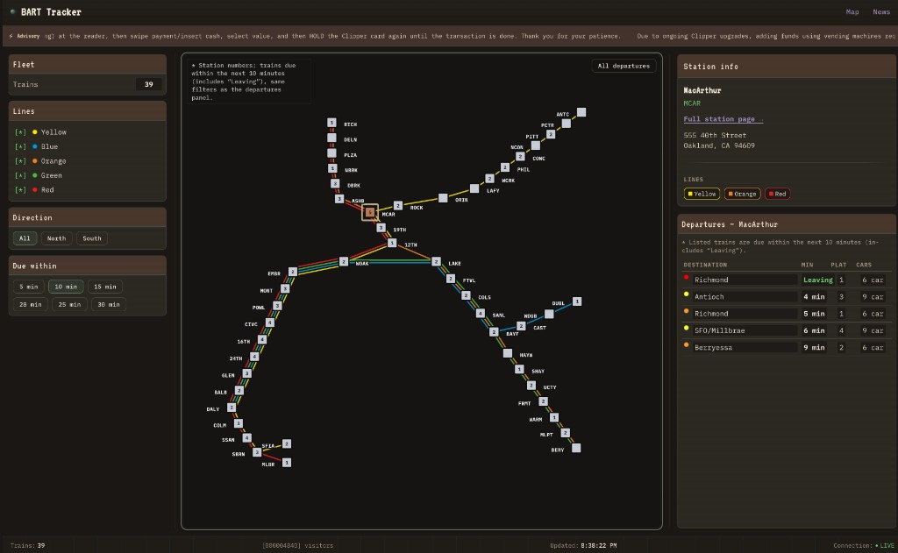

# TrainProject — BART live map

A retro-styled web app for the [San Francisco Bay Area BART](https://www.bart.gov/) system: interactive map, live train positions, departures, advisories, elevator status, and per-station detail pages. Data comes from the [official BART API](https://api.bart.gov/).

## Screenshot

Map view with line and direction filters, animated train positions, and the departures panel for a selected station.



## Features

- **System map** with stations and train blips, plus line and direction filters
- **Sidebar**: selected station info, departure board (ETD), train count, filters
- **Alert ticker** for system advisories
- **Station routes** at `/station/:abbr` (BART station abbreviation)
- **About** page at `/about`

## Stack

- [React](https://react.dev/) 19 + [TypeScript](https://www.typescriptlang.org/)
- [Vite](https://vitejs.dev/) 8
- [TanStack Query](https://tanstack.com/query) for server state
- [Zustand](https://zustand-demo.pmnd.rs/) for UI state
- [React Router](https://reactrouter.com/) 7
- [Framer Motion](https://www.framer.com/motion/) for motion
- Optional **[Cloudflare Worker](https://developers.cloudflare.com/workers/)** (`worker/`) that proxies and caches BART API responses under `/api`

## Prerequisites

- **Node.js** 20+ (or current LTS) recommended

## Setup

```bash
git clone https://github.com/joshchng/TrainProject.git
cd TrainProject
npm install
```

### Environment (optional)

Create a `.env` in the project root if you need to override defaults:

| Variable | Purpose |
|----------|---------|
| `VITE_API_BASE_URL` | API prefix for the frontend (default: `/api`) |
| `VITE_BART_API_KEY` | Reserved if you call BART directly from the client; the included worker uses BART’s public demo key |

`.env` is gitignored—do not commit real secrets.

## Development

**Frontend only** (Vite dev server; `/api` is proxied when a worker is available):

```bash
npm run dev
```

**Frontend + local API proxy** (run the Worker on port `8787`, matching `vite.config.ts`):

```bash
npm run dev:worker   # terminal 1
npm run dev          # terminal 2
```

Open the URL Vite prints (usually `http://localhost:5173`).

## Scripts

| Command | Description |
|---------|-------------|
| `npm run dev` | Vite dev server with HMR |
| `npm run build` | Typecheck + production build to `dist/` |
| `npm run preview` | Serve the production build locally |
| `npm run lint` | ESLint |
| `npm run dev:worker` | `wrangler dev` for the Cloudflare Worker |

## Deploying

- **Static UI**: build with `npm run build` and host the `dist/` output on any static host.
- **API**: deploy the Worker from `worker/` (see `worker/wrangler.toml`) and point `VITE_API_BASE_URL` at your deployed `/api` base in production builds if it differs from the default.

## License

This project is for personal/educational use. BART schedules and data are provided by BART; use of the API is subject to [BART’s terms](https://www.bart.gov/about/developers).
